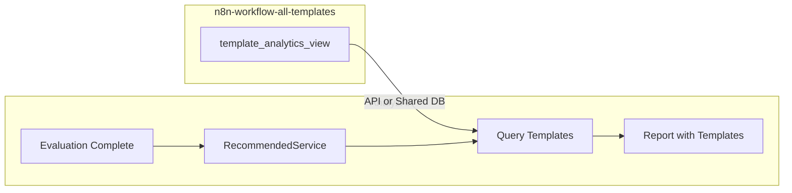

# Enriched Data → Analyzax Integration Plan

## Current State: Enriched Data in n8n-workflow-all-templates

The `template_analytics` table (exposed via `template_analytics_view`) contains industry- and process-oriented metadata per n8n template:


| Field                            | Type    | Description                                                                      |
| -------------------------------- | ------- | -------------------------------------------------------------------------------- |
| `applicable_industries`          | JSONB   | `[{name, confidence, ...}]` — industries the template serves                     |
| `applicable_processes`           | JSONB   | `[{name, confidence, ...}]` — processes (e.g. Lead Generation, Customer Support) |
| `top_2_industries`               | JSONB   | Top 2 industries from use_case_description                                       |
| `top_2_processes`                | JSONB   | Top 2 processes from use_case_description                                        |
| `use_case_name`                  | text    | Template title                                                                   |
| `use_case_description`           | text    | Generated description                                                            |
| `unique_common_serviceable_name` | text    | Plain-English name (~15–25 chars) for non-technical users                        |
| `final_price_inr`                | numeric | Pricing (INR)                                                                    |
| `template_id`                    | uuid    | Links to `templates` (source_id, title, source_url, etc.)                        |


Data is stored in **Supabase** and queryable via the view. See [docs/enrichment-guide.md](docs/enrichment-guide.md) and [docs/database-schema.md](docs/database-schema.md).

---

## Integration Patterns (Choose Based on Analyzax)


| Pattern              | When to use                                            | Effort                                                               |
| -------------------- | ------------------------------------------------------ | -------------------------------------------------------------------- |
| **Shared Supabase**  | Analyzax already uses or can use same Supabase project | Low — Analyzax reads `template_analytics_view`                       |
| **API layer**        | Analyzax is separate; needs a clean contract           | Medium — Add REST/GraphQL endpoint in explorer or standalone service |
| **Scheduled export** | Analyzax prefers file/event input                      | Medium — Cron job exports JSON/CSV to S3, webhook, or file path      |
| **Real-time sync**   | Analyzax needs live updates                            | Higher — Supabase Realtime or event-driven pipeline                  |


---

## Data Contract for Industry Input (Proposed)

Analyzax needs industry + process + service metadata. A minimal payload per "service" (n8n template) could look like:

```json
{
  "template_id": "uuid",
  "source_id": "n8n-template-id",
  "source_url": "https://n8n.io/workflow/...",
  "use_case_name": "string",
  "unique_common_serviceable_name": "string",
  "use_case_description": "string",
  "industries": ["Industry1", "Industry2"],
  "processes": ["Process1", "Process2"],
  "top_2_industries": [{"name": "..."}, {"name": "..."}],
  "top_2_processes": [{"name": "..."}, {"name": "..."}],
  "final_price_inr": number
}
```

`industries`/`processes` can be derived from `applicable_industries`/`applicable_processes` (extracting `name` and optionally `top_2_*`). The exact shape should be aligned with Analyzax’s expected schema once available.

---

## Refined Integration Decision and Details

**Decision:** API from n8n-workflow explorer. Report generates without "Suggested Workflows" if API fails. **Mapping:** n8n processes → AnalyzAX services via partial match. **Scope:** 10–15 templates total, only enriched. **Report UX:** Add section after Recommended Services; omit if no matches. **Technical:** API in n8n explorer; AnalyzAX calls from `generateReport.ts` when `N8N_TEMPLATES_API_URL` set; 3s timeout.

1. ~~Define Analyzax input schema~~ — After receiving Analyzax readme/path, map `template_analytics_view` columns to Analyzax’s expected industry input format.

~~2. **Choose integration pattern~~** — Shared DB, API, or export, based on Analyzax’s architecture.
3. **Add data access** — Either:

- **Shared DB:** Document Supabase connection and RLS/views for Analyzax, or
- **API:** Add endpoint (e.g. `GET /api/analyzax/industry-data`) that returns the mapped payload, or
- **Export:** Add script `npm run export:analyzax` that writes JSON/CSV to a configurable path or S3.

1. **Handle updates** — Decide if Analyzax needs incremental updates (e.g. `updated_at` filter, webhook on enrichment completion) or full refresh only.

---

## AnalyzAX (Evaluation Manager) — Discovered Structure

**Path:** `X:\Evaluation manager` (contains `evaluation-manager/` subfolder)

### What AnalyzAX Does

- Chatbot that evaluates customer needs via 15–30 dynamic questions
- Hybrid scoring (rule-based 50% + AI 50%)
- Matches users to **6–7 Autoom Studio service categories**: Customer Management, Lead Generation, Email Management, Task Management, Workflow Management, Resource Management, AI Calling Agent (plus Chatbot Implementation, AI Customer Support Agent)
- Outputs `RecommendedService[]` with `service_name`, `match_percentage`, `reasoning`, `features`
- Evaluations have `industry` (user-selected, NAICS-style: Manufacturing, Healthcare, Retail, etc.)
- Uses Supabase (`evaluations`, `evaluation_results`, `question_bank`)
- Types mention "Removed N8n Workflow Types - No longer using n8n workflows" — integration would reintroduce n8n templates

### Project Analysis Summary (from provided doc)

- **Status:** Production-ready MVP, 43 DB migrations
- **Key APIs:** `POST /api/chat/complete`, `POST /api/report/generate` (uses `generateReportForEvaluation`)
- **Report flow:** `evaluation` + `evaluation_results` → `generateReport.ts` → PDF + HTML
- **Scoring:** Pain points 40%, Urgency 25%, Implementation readiness 20%, Budget 15%
- **6 core services** (from PROJECT_ANALYSIS): Customer Management, Lead Generation, Email Management, Task Management, Workflow Management, Resource Management

### Service ↔ Process Mapping (n8n → AnalyzAX)


| n8n `applicable_processes` / `top_2_processes`   | AnalyzAX service category            |
| ------------------------------------------------ | ------------------------------------ |
| Lead Generation, Customer Support, CRM, …        | Lead Generation, Customer Management |
| Email, Marketing, Campaigns                      | Email Management                     |
| Document processing, Data entry, Task automation | Task Management                      |
| Workflow, Process optimization, Automation       | Workflow Management                  |
| Resource allocation, Quality control, Inventory  | Resource Management                  |


Industry alignment: n8n `applicable_industries` / `top_2_industries` (e.g. Healthcare, Retail) map to AnalyzAX NAICS-style industries and `AUTOOM_SERVICE_CATALOG.industries` (e.g. Retail/E-commerce, Healthcare).

### Integration Flow (Proposed)




1. User completes evaluation → AnalyzAX produces `recommended_services` (e.g. Lead Generation, Customer Management) and `evaluation.industry`.
2. AnalyzAX (or a new API) queries enriched templates WHERE industries/processes match user industry + recommended services.
3. Report shows both high-level service recommendations and concrete n8n templates (use_case_name, source_url, final_price_inr, unique_common_serviceable_name).

---

## Recommended Integration Pattern

**Option A — API from n8n explorer (recommended)**  

- Add `GET /api/analyzax/templates?industry=Healthcare&services=Lead%20Generation,Customer%20Management&limit=10` to n8n-workflow explorer  
- Returns templates filtered by industry + process match  
- AnalyzAX calls this when generating the report (or after completion)

**Option B — Shared Supabase**  

- AnalyzAX connects to the same Supabase project as n8n-workflow (or uses a read replica)  
- Add RLS/views so AnalyzAX can read `template_analytics_view` safely  
- Requires both projects to share Supabase or set up cross-project access

**Option C — Sync table in AnalyzAX Supabase**  

- Cron/schedule job in n8n-workflow exports enriched data to AnalyzAX’s DB (e.g. `n8n_templates` table)  
- AnalyzAX queries locally; no runtime dependency on n8n-workflow

---

## Implementation Todos

1. **Create mapping layer** — Map n8n `applicable_industries` / `applicable_processes` names to AnalyzAX service names and NAICS industries (normalization table or function).
2. **Add API endpoint** — In n8n-workflow explorer: `GET /api/analyzax/templates` with `industry`, `services`, `limit` query params; filter `template_analytics_view` and return JSON.
3. **Integrate in AnalyzAX** — After `evaluation_results` is saved, call the API (or query shared DB) and attach template recommendations to the report.
4. **Update report UI** — Display "Suggested n8n workflows" section with template name, description, price, and source_url link.

---

## Relevant Files

**n8n-workflow-all-templates:**

- [docs/enrichment-guide.md](docs/enrichment-guide.md) — Enrichment pipeline and query examples
- [docs/database-schema.md](docs/database-schema.md) — `template_analytics` and `template_analytics_view`
- [supabase/migrations/20250217000004_add_top_industries_processes.sql](supabase/migrations/20250217000004_add_top_industries_processes.sql) — View with `top_2`_*; add migration if `unique_common_serviceable_name` and `t.source_url` are needed for API response
- [scripts/enrichment/types.ts](scripts/enrichment/types.ts) — TypeScript types

**AnalyzAX (X:\Evaluation manager\evaluation-manager):**

- `lib/report/generateReport.ts` — Integration hook for template fetch
- `lib/evaluation/serviceMapping.ts` — Service catalog and industry/service mapping
- `lib/evaluation/scoringEngine.ts` — AUTOOM_SERVICES constants
- `types/index.ts` — RecommendedService, Evaluation types
- `app/report/[evaluationId]/page.tsx` — Report rendering

