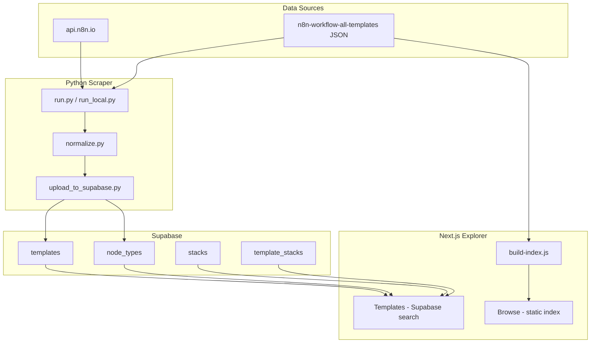
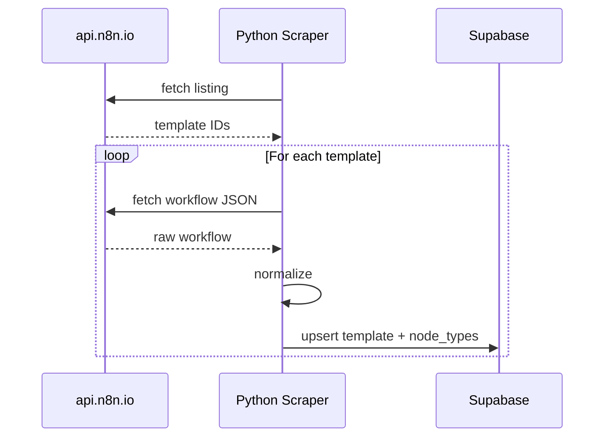
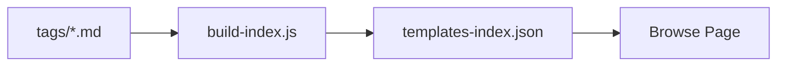
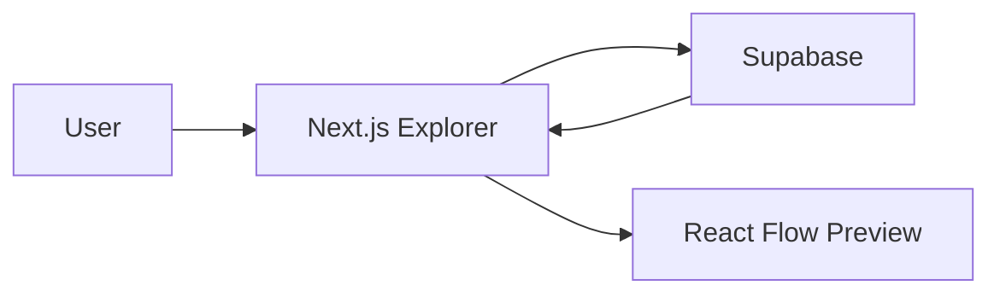

# System Architecture

> Last updated: 2025-02

This document describes the architecture of n8n-workflow-all-templates, including data flow, component responsibilities, and design decisions.

## Table of Contents

- [Overview](#overview)
- [Architecture Diagram](#architecture-diagram)
- [Polyglot Structure](#polyglot-structure)
- [Data Flow](#data-flow)
- [Component Responsibilities](#component-responsibilities)
- [Technology Stack](#technology-stack)
- [Design Decisions](#design-decisions)

## Overview

The project is a polyglot system that:

1. Ingests n8n workflow templates from the official API or local JSON files
2. Normalizes and stores them in Supabase
3. Serves them via a Next.js explorer with two browsing modes

## Architecture Diagram

## Polyglot Structure

| Component | Technology | Purpose |
|-----------|------------|---------|
| **explorer/** | Next.js 16, TypeScript, React 19 | Web application with Browse and Templates pages |
| **scripts/scraper/** | Python 3.x, Supabase client | Fetch, normalize, and upload templates |
| **webapp/** | Vite, React (legacy) | Previous app; Browse behavior merged into Next.js |

## Data Flow

### Template Ingestion

### Browse Page (Static)

### Templates Page (Dynamic)

## Component Responsibilities

### Python Scraper (`scripts/scraper/`)

| Module | Responsibility |
|--------|----------------|
| `fetch_listing.py` | Get all template IDs from api.n8n.io |
| `fetch_detail.py` | Fetch full workflow JSON per ID |
| `normalize.py` | Extract node types, tags, category; convert to schema |
| `upload_to_supabase.py` | Upsert templates and node_types |
| `state.py` | Persist progress for resumable runs |
| `run.py` | Orchestrate API sync pipeline |
| `run_local.py` | Load from local JSON files |
| `enrich_metadata.py` | AI-assisted metadata enrichment |

### Next.js Explorer (`explorer/`)

| Area | Responsibility |
|------|----------------|
| `/browse` | Static index, tag/service filters, download JSON/ZIP |
| `/templates` | Supabase search, node-type/tag/stack filters, React Flow preview |
| `useIndexTemplates` | Browse: filter, sort, load static index |
| `useTemplateSearch` | Templates: Supabase queries, pagination |
| `n8n-to-reactflow.ts` | Convert n8n workflow JSON to React Flow format |
| `WorkflowViewer` | React Flow visualization component |

### Supabase

| Table | Purpose |
|-------|---------|
| `templates` | Workflow metadata, nodes, raw_workflow, full-text search |
| `node_types` | Join table for node-type filtering |
| `stacks` | Stack labels for filtering |
| `template_stacks` | Link templates to stacks |

## Technology Stack

| Layer | Technology | Rationale |
|-------|------------|-----------|
| Frontend | Next.js 16, React 19 | App Router, RSC, modern tooling |
| Styling | Tailwind CSS 4 | Utility-first, fast iteration |
| Data Fetching | TanStack Query | Caching, loading states |
| Visualization | React Flow | Workflow graph rendering |
| Database | Supabase (PostgreSQL) | Managed Postgres, RLS, full-text search |
| Scraper | Python 3.x | requests, supabase-py, dotenv |
| Build | Node.js scripts | build-index.js, copy-index.js |

## Design Decisions

### Two Browsing Modes

- **Browse**: Works without Supabase; uses pre-built `templates-index.json`. Ideal for static deployment and offline use.
- **Templates**: Requires Supabase; supports full-text search, node-type filters, and React Flow preview. Ideal for discovery and exploration.

### Resumable Scraper

The scraper persists state after each batch so runs can resume after interruption. State includes `last_source_id`, `total_synced`, and `total_errors`.

### RLS (Row Level Security)

- Public read on `templates`, `node_types`, `stacks`, `template_stacks`
- Writes use service role key (scraper only)
- Explorer uses anon key; no write access from frontend

### Node Type Extraction

Workflow nodes are parsed to extract `type`; these are stored in `node_types` for faceted search. Enables "find templates using OpenAI node" without scanning full JSON.

## See Also

- [Database Schema](database-schema.md)
- [Scraper Guide](scraper-guide.md)
- [API Reference](api-reference.md)
- [Setup](setup.md)
