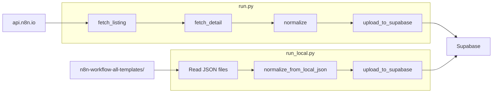

# Scraper Guide

> Comprehensive documentation for the Python scraper that ingests n8n workflow templates.

## Table of Contents

- [Overview](#overview)
- [Architecture](#architecture)
- [run.py: API Sync](#runpy-api-sync)
- [run_local.py: Local JSON](#run_localpy-local-json)
- [State Management](#state-management)
- [Normalization](#normalization)
- [Upload](#upload)
- [AI Metadata Enrichment](#ai-metadata-enrichment)

## Overview

The scraper has two entry points:

| Script | Source | Use Case |
|--------|--------|----------|
| `run.py` | api.n8n.io | Sync from official n8n API |
| `run_local.py` | Local JSON files | Load from `n8n-workflow-all-templates/` |

Both normalize workflows and upload to Supabase.

## Architecture



## run.py: API Sync

Syncs templates from `https://api.n8n.io/templates/search`.

### Usage

**Interactive mode** (TTY):

```bash
npm run scrape
# or
cd scripts/scraper && python run.py
```

Prompts for batch size, delay, limit, and whether to resume.

**Non-interactive / CI mode**:

```bash
python run.py [--limit N] [--skip N] [--batch-size N] [--delay SECONDS] [--no-resume] [--dry-run]
```

### Arguments

| Argument | Type | Default | Description |
|----------|------|---------|-------------|
| `--limit` | int | 0 | Max templates to sync (0 = all) |
| `--skip` | int | 0 | Skip first N in listing |
| `--batch-size` | int | 50 | Templates per batch (state saved after each) |
| `--delay` | float | 0.3 | Seconds between requests |
| `--no-resume` | flag | — | Ignore saved state, start from scratch |
| `--dry-run` | flag | — | Fetch and normalize only; do not upload |

### Examples

```bash
# Sync first 100 templates
python run.py --limit 100

# Resume from last run
python run.py

# Start fresh, no resume
python run.py --no-resume

# Dry run (no Supabase writes)
python run.py --dry-run --limit 10
```

### Flow

1. Fetch full listing from api.n8n.io (paginated)
2. Load existing state (if not `--no-resume`)
3. Preload existing `source_id`s from Supabase to skip already-synced templates
4. For each template: fetch detail → normalize → upload
5. Save state after each batch
6. Skip templates that already exist in Supabase

## run_local.py: Local JSON

Loads workflows from `n8n-workflow-all-templates/n8n-workflow-all-templates/**/*.json`.

### Usage

```bash
npm run scrape:local
# or
cd scripts/scraper && python run_local.py [--limit N] [--skip N]
```

### Arguments

| Argument | Description |
|----------|-------------|
| `--limit` | Max files to process |
| `--skip` | Skip first N files |

### Flow

1. Discover all `.json` files under the templates directory
2. For each file: load → normalize (via `normalize_from_local_json`) → upload
3. Uses `meta.id` or filename as `source_id`

## State Management

State is stored in `scripts/scraper/.scraper_state.json`:

```json
{
  "last_source_id": "12345",
  "last_run_utc": "2025-02-17T12:00:00Z",
  "total_synced": 5000,
  "total_errors": 12
}
```

- **load_state()** — Load from disk; returns `None` if absent or invalid
- **save_state()** — Persist after each batch
- Resume finds `last_source_id` in the current listing and skips already-synced templates

## Normalization

**normalize.py** converts raw n8n JSON to our schema:

| Output Field | Source |
|--------------|--------|
| `source_id` | API ID or file meta/filename |
| `title` | Workflow name |
| `description` | Workflow description |
| `category` | Mapped from tags via `CATEGORY_BY_TAG` |
| `tags` | Extracted and normalized |
| `nodes` | Normalized node array |
| `raw_workflow` | Full workflow JSON |
| `source_url` | Template URL |
| `node_type_counts` | Extracted from nodes |

Node types are taken from each node's `type` field (e.g., `n8n-nodes-base.openAi`).

## Upload

**upload_to_supabase.py**:

1. Upsert template into `templates` (on `source_id` conflict)
2. Delete existing `node_types` for that template
3. Insert new `node_types` from `node_type_counts`

Requires `SUPABASE_URL` and `SUPABASE_SERVICE_ROLE_KEY` in `scripts/scraper/.env`.

## AI Metadata Enrichment

**enrich_metadata.py** uses OpenAI to improve categories/descriptions for templates. Optional.

Requirements:

- `OPENAI_API_KEY` in `.env`
- Optional: `OPENAI_MODEL`, `AI_BATCH_SIZE`, `AI_BATCH_DELAY_MS`

```bash
npm run enrich:metadata
```

## Module Reference

| Module | Purpose |
|--------|---------|
| `fetch_listing.py` | Paginate api.n8n.io templates/search |
| `fetch_detail.py` | Fetch single workflow JSON |
| `normalize.py` | Normalize API/local payload to schema |
| `upload_to_supabase.py` | Upsert templates and node_types |
| `state.py` | Load/save scraper state |
| `run.py` | API sync pipeline |
| `run_local.py` | Local JSON pipeline |
| `enrich_metadata.py` | AI enrichment |
| `ai_categorizer.py` | OpenAI categorization logic |

## See Also

- [Setup](setup.md) — Environment configuration
- [Database Schema](database-schema.md) — Target schema
- [API Reference](api-reference.md) — Python module APIs
